## Problem Statement

In the competitive retail industry, the ability to predict future sales accurately is crucial for operational and strategic planning. Product sales forecasting aims to estimate the number of products a store will sell in the future, based on various influencing factors such as store type, location, regional characteristics, promotional activities, and temporal variations (such as holidays and seasons). This project focuses on developing a predictive model that uses historical sales data from different stores to forecast sales for upcoming periods.

**Problem statement decoded - Supply chain optimization**

***Forecasting total sales per day:***     
1. Helps in total production planning based on demand      
2. Procurement of raw materials in bulk, reducing the procurement cost       
3. Manpower & utility allocation     
4. Optimise sales promotions based on drops & spikes in sales 

***Forecasting total sales per day per region***      
1. Helps in region wise demand planning
2. Logistics planning

***Forecasting total sales per day per region per store***
1. Helps in inventory management
2. Staffing

***Data:***

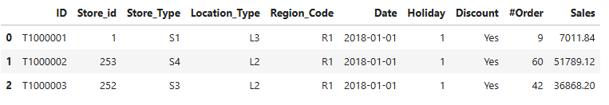 

ID: Unique identifier for each record in the dataset.    
Store_id: Unique identifier for each store.    
Store_Type: Categorization of the store based on its type.    
Location_Type: Classification of the store's location (e.g., urban, suburban).    
Region_Code: Code representing the geographical region where the store is located.     
Date: The specific date on which the data was recorded.    
Holiday: Indicator of whether the date was a holiday (1: Yes, 0: No).    
Discount: Indicates whether a discount was offered on the given date (Yes/No)     
#Order: The number of orders received by the store on the specified day.    
Sales: Total sales amount for the store on the given day.     

## EDA
1. Uni-variate analysis using line plots & Histograms
2. Identifying & treating: Missing values, Outliers
3. Bi-variate analysis

***Uni-variate Analysis:***

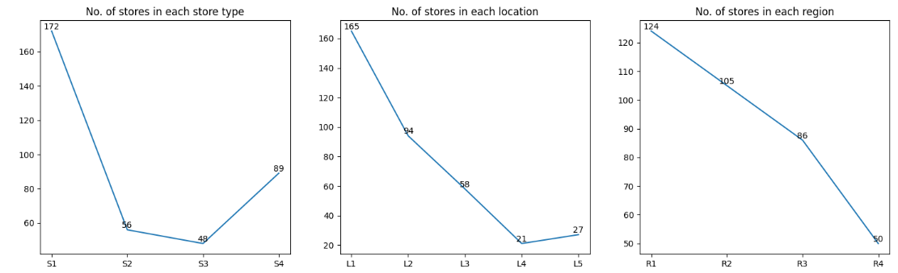 
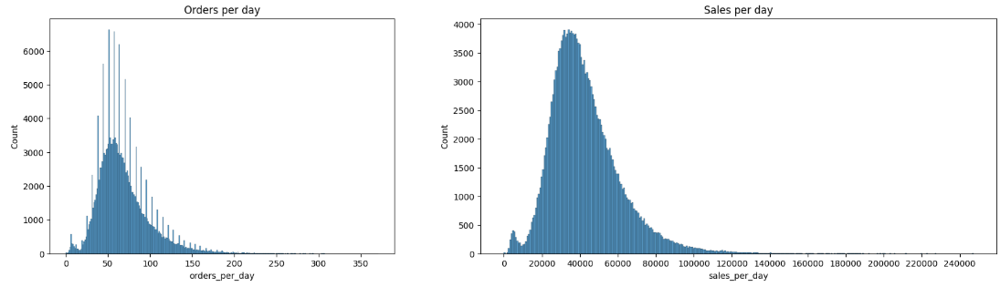 

1. Data has continuous dates from first to last     
2. Around 47% of total stores belong to S1, which is the highest. Around 62% of total stores belong to S1 & S4     
3. Around 45% of stores are located in L1, which is the highest. Around 71% of stores are located in L1 & L2     
4. Around 34% percentage of stores are present in region, R1 which is the highest. Around 63% of stores are situated in regions R1 & R2     
5. Around 13% of the data recorded are holidays     
6. Around 45% of the data recorded have discounts     
7. Median number of orders per day is around 50 & Median sales per day is around 35,000    
8. No missing values in the data

***Bi-variate Analysis:***

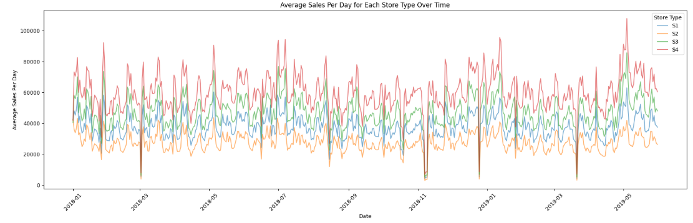 
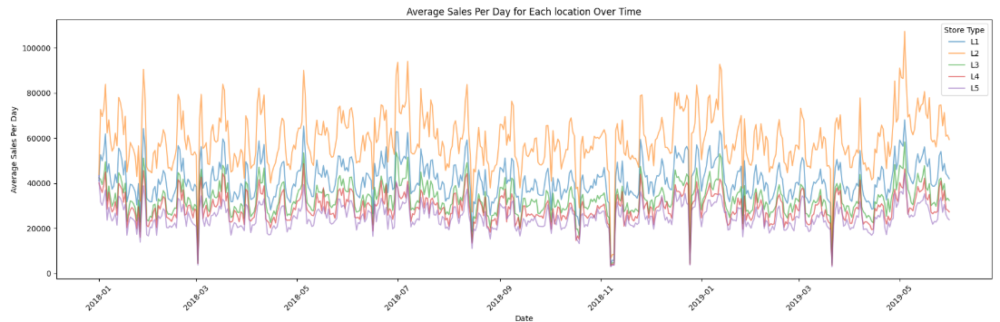 
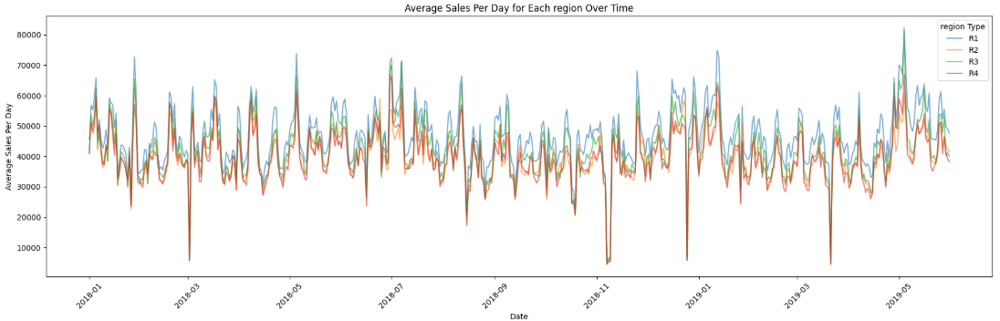 
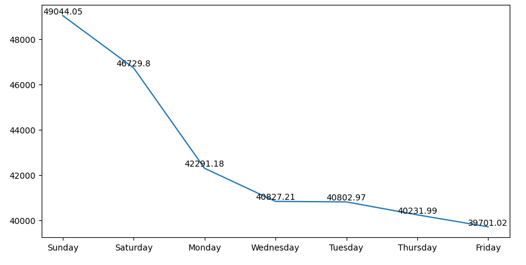 

9. Highest average sales per day store-wise: S4 > S3 > S1 > S2
10. Highest average sales per day location-wise: L2 > L1 > L3 > L4 > L5
11. Highest average sales per day region-wise: R1 > R2 > R3 > R4
12. Median sales per day on holidays is 33,418 against 40,530 on non-holidays
13. Median sales per day on discount days is 46,242 against 34,791 on non-discount days

## Time Series Characteristics

Any time series visualization may consist of the following components: Base Level + Trend + Seasonality + Error

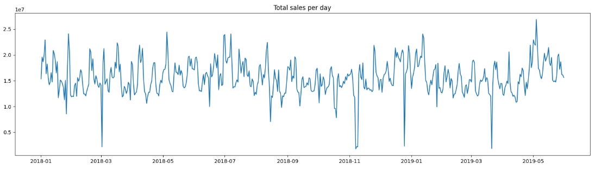

***Auto-correlation***

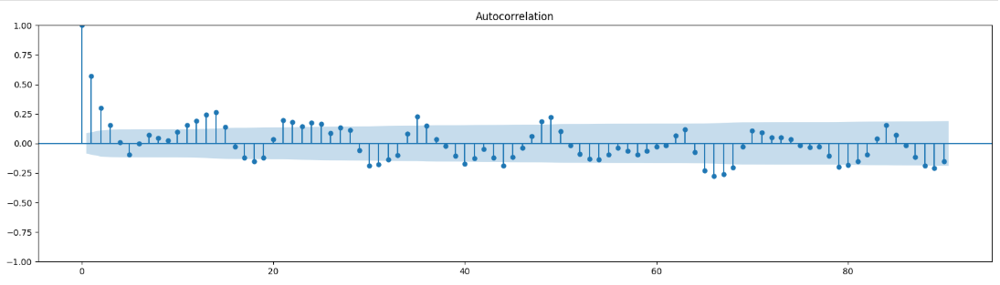

***Decomposition***

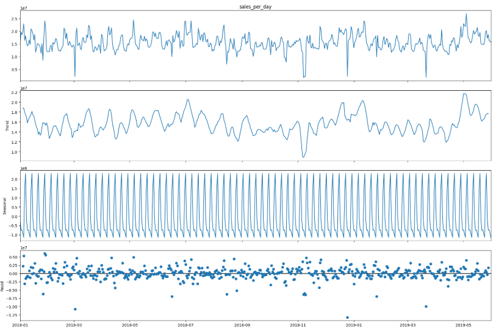

***Stationarity***

A stationary series is one where the values of the series is not a function of time. Hence the statistical properties of the series like mean, variance and autocorrelation are constant over time. This makes it easier for models to detect patterns and make accurate predictions

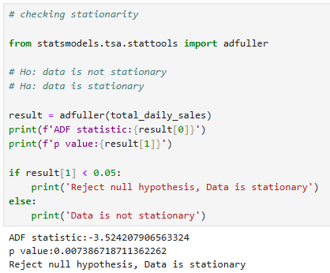

***Insights:***

Total daily sales is taken putting all the store sales together, analysing time series characteristics using line plots & time series decomposition:

1. There is a fluctuating trend, but no clear cyclic pattern     
2. Seasonality is visible from the decomposition but not clear     
3. The seasonal component looks stable (constant peaks and troughs) → Suggests an additive model      
4. The residuals appear random, which suggests that most of the signal has been captured by the trend and seasonality components      
5. Data is stationary

## Model Building

***Forecasting - Total sales per day***

This forecast helps in broader planning like production planning & raw material procurement: 
1. Accurate forecasting helps in bulk buying of raw materials which reduces procurement costs
2. Manpower & Utility allocation is optimised

These optimization help company reduce operating costs, therefore increasing operating margins

***Baseline Model***

Without any feature engineering & exogenous variables, baseline model is built

 

