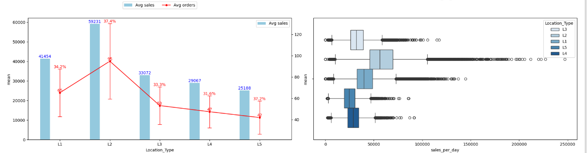
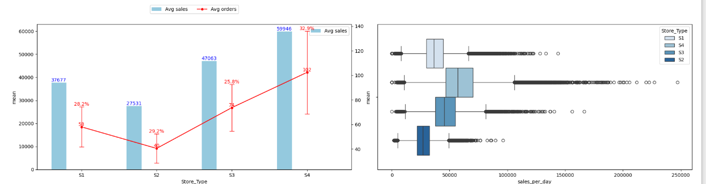
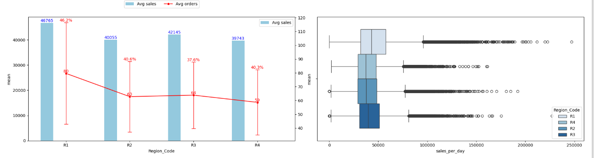
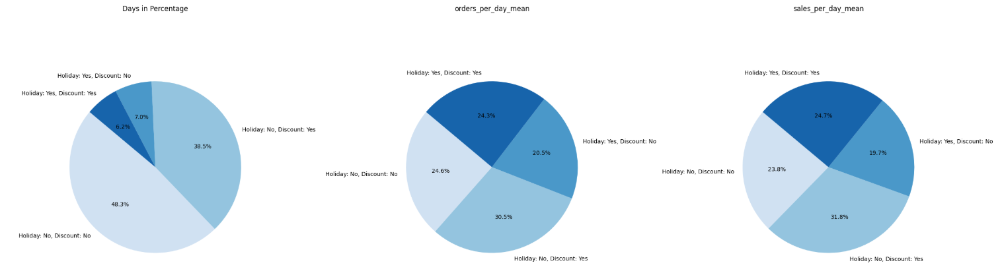
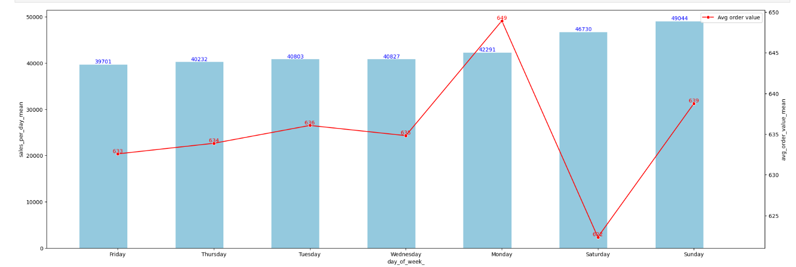

## Problem Statement:

In the competitive retail industry, the ability to predict future sales accurately is crucial for operational and strategic planning. Product sales forecasting aims to estimate the number of products a store will sell in the future, based on various influencing factors such as store type, location, regional characteristics, promotional activities, and temporal variations (such as holidays and seasons). This project focuses on developing a predictive model that uses historical sales data from different stores to forecast sales for upcoming periods.

**Supply Chain Optimization**

1. Total Sales Forecasting:
  * Facilitates comprehensive ***production planning*** aligned with demand, enables bulk raw material procurement, ***reducing procurement costs*** & supports efficient allocation of manpower and utilities
  * Optimizes ***sales promotions*** by identifying sales spikes and drops
  * Assists in region-specific demand planning, enhances ***logistics and distribution management***
  * Improves ***inventory management*** by anticipating store-level demand and ensures optimal staffing and resource allocation
2. Impact of Holiday on sales
3. Impact of discount on sales

**Data:**

 

ID: Unique identifier for each record in the dataset.    
Store_id: Unique identifier for each store.    
Store_Type: Categorization of the store based on its type.    
Location_Type: Classification of the store's location (e.g., urban, suburban).    
Region_Code: Code representing the geographical region where the store is located.     
Date: The specific date on which the data was recorded.    
Holiday: Indicator of whether the date was a holiday (1: Yes, 0: No).    
Discount: Indicates whether a discount was offered on the given date (Yes/No)     
#Order: The number of orders received by the store on the specified day.    
Sales: Total sales amount for the store on the given day.  

## EDA

 

 

 

 

1. ***Day Distribution:*** Majority of days (48.3%) had no holiday, no discount. Only 6.2% of days had both holiday and discount
2. ***Order Volume:*** Highest orders on non-holiday discount days (30.5%). Holiday no-discount days had the lowest order share (20.5%)
3. ***Sales Volume:*** Highest sales on non-holiday discount days (31.8%). Followed by holiday + discount days (24.7%)

***Insight:***

1. Discounts strongly boost both orders and sales, regardless of holidays
2. Holidays alone do not guarantee higher sales or orders—discounts are key

 

***Key Findings:***

1. Sunday had the highest average sales (~₹49,044) and strong average order value (₹639)
2. Saturday followed with ~₹46,730 in sales, but had the lowest avg order value (₹623), indicating high order volume
3. Monday had the highest average order value (₹649), despite lower total sales than the weekend
4. Weekdays (Tue–Fri) showed relatively stable sales (₹39k–₹41k) and avg order values (₹631–₹636)

***Insights:***

1. Weekends drive higher revenue, likely due to more consumer activity - ***Leverage weekends for promotions to maximize volume***
2. Monday shows fewer but higher-value orders—suggesting potential for premium offerings - ***Explore targeted campaigns on Mondays for high-value customers***

## Data Pre-Processing

## Model Building

### Total Forecast:

1. SARIMAX: ***Train MAPE - 9.85% | Val MAPE - 9.96%***
2. Prophet:

### Rolling Forecast:

1. SARIMAX: ***Train MAPE - 7.24% | Val MAPE - 7.81%***      
2. Prophet:
3. ML Models    
   XGBoost - ***Val MAPE -  | Train MAPE - ***
5. DL Models
   NN - ***Val MAPE -  | Train MAPE - ***

## Outcome

Accurate forecasting of sales has 3 major benefits:

* Accurate production levels
* Reduced logistic costs
* Optimized Inventory space

***Recommendations:***

1. Required production level = Upper limit of 95% CI -
   * Meets sales demand, avoids under stocking, leads to higher revenue
   * Adjust the remaining inventory in tomorrow's forecast & plan production accordingly
   * Extra inventory space required <= 4% of total sales per day
   * Optimised operational costs by proper man power allocation & utility planning
2. Since aggregated forecast values from individual regions <= Upper limit of 95% CI & forecast error MAPE < 1%, use:
   * For production - Forecasts from Total sales per day
   * For logistics planning - Forecasts from individuals regions
   * This way we ensure there is no overproduction & any minor demand variations in individual regions are also met easily
  

 

