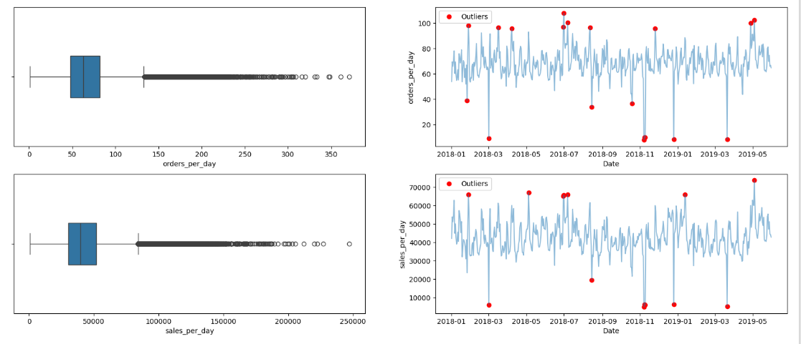
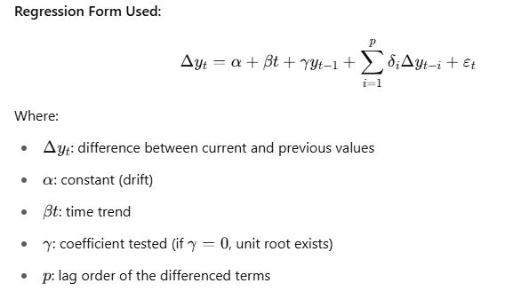
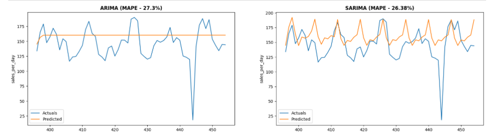
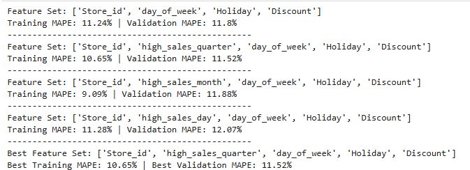
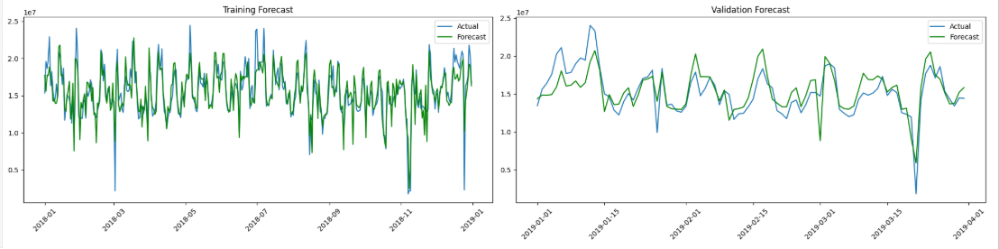
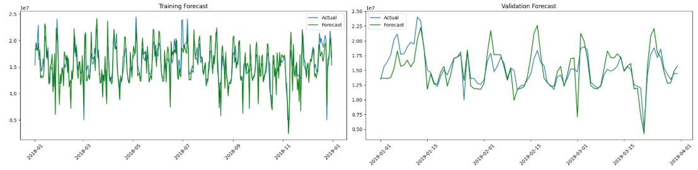

## Problem Statement

In the competitive retail industry, the ability to predict future sales accurately is crucial for operational and strategic planning. Product sales forecasting aims to estimate the number of products a store will sell in the future, based on various influencing factors such as store type, location, regional characteristics, promotional activities, and temporal variations (such as holidays and seasons). This project focuses on developing a predictive model that uses historical sales data from different stores to forecast sales for upcoming periods

**Supply Chain Optimization**

1. Total Sales Forecasting:
   * Facilitates comprehensive ***production planning*** aligned with demand, enables bulk raw material procurement, ***reducing procurement costs*** & supports efficient allocation of manpower and utilities
   * Optimizes ***sales promotions*** by identifying sales spikes and drops
   * Assists in region-specific demand planning, enhances ***logistics and distribution management***
   * Improves ***inventory management*** by anticipating store-level demand and ensures optimal staffing and resource allocation
2. Impact of Holiday on sales
3. Impact of discount on sales

**Data:**

 

ID: Unique identifier for each record in the dataset       
Store_id: Unique identifier for each store       
Store_Type: Categorization of the store based on its type.    
Location_Type: Classification of the store's location (e.g., urban, suburban).    
Region_Code: Code representing the geographical region where the store is located.     
Date: The specific date on which the data was recorded.    
Holiday: Indicator of whether the date was a holiday (1: Yes, 0: No)       
Discount: Indicates whether a discount was offered on the given date (Yes/No)       
Order: The number of orders received by the store on the specified day     
Sales: Total sales amount for the store on the given day

## EDA

***Key Findings:***

1. ***S4*** leads with the highest average sales (~59.9k) and orders/day (102), showing strong revenue and customer activity despite high variability
2. ***S3*** performs well with solid sales and order volume
3. ***S1*** has moderate sales but lower order efficiency
4. ***S2*** underperforms with the lowest sales and orders/day, though it's the most consistent

***Insights:***

1. ***S4*** is the most profitable but volatile. ***S2*** shows stability but lacks performance

 

***Key Findings:***

1. ***S4*** leads with the highest average sales (~59.9k) and orders/day (102), showing strong revenue and customer activity despite high variability
2. ***S3*** performs well with solid sales and order volume
3. ***S1*** has moderate sales but lower order efficiency
4. ***S2*** underperforms with the lowest sales and orders/day, though it's the most consistent

***Insights:***

1. ***S4*** is the most profitable but volatile. ***S2*** shows stability but lacks performance

 

***Key Findings:***

1. ***R1*** has the highest avg sales (~46.8k) and high orders/day (69), but also the highest variability (46.2%)
2. ***R2, R3, R4*** have similar avg sales (~40k–42k) with ***R4*** having the lowest order volume (57/day)
3. ***R3*** shows relatively better order efficiency (37.6%)

***Insights:***

1. ***R1*** is the top-selling but most volatile region. ***R4*** lags in order volume. All regions show similar sales but vary in efficiency and consistency

 

1. ***Day Distribution:*** Majority of days (48.3%) had no holiday, no discount. Only 6.2% of days had both holiday and discount
2. ***Order Volume:*** Highest orders on non-holiday discount days (30.5%). Holiday no-discount days had the lowest order share (20.5%)
3. ***Sales Volume:*** Highest sales on non-holiday discount days (31.8%). Followed by holiday + discount days (24.7%)

***Insights:***

1. Discounts strongly boost both orders and sales, regardless of holidays
2. Holidays alone do not guarantee higher sales or orders—discounts are key

 

***Key Findings:***

1. Sunday had the highest average sales (~₹49,044) and strong average order value (₹639)
2. Saturday followed with ~₹46,730 in sales, but had the lowest avg order value (₹623), indicating high order volume
3. Monday had the highest average order value (₹649), despite lower total sales than the weekend
4. Weekdays (Tue–Fri) showed relatively stable sales (₹39k–₹41k) and avg order values (₹631–₹636)

***Insights:***

1. Weekends drive higher revenue, likely due to more consumer activity - ***Leverage weekends for promotions to maximize volume***
2. Monday shows fewer but higher-value orders—suggesting potential for premium offerings - ***Explore targeted campaigns on Mondays for high-value customers***

## Data Pre-Processing

***Missing Values:***

* No missing values

***Outliers:***

* ***Red dots*** represent outliers in the line plots, which are identified using ***IQR***
* Outliers could be because of various reasons like wrong entry, higher sales due to festivals, etc

***Assumptions:***

1. Spikes & drops in sales are supported by no. of orders placed, so I am assuming that due to some external event, these spikes & drops in sales are noticed

## Model Building

Any time series may consist of the following components: ***Base Level + Trend + Seasonality + Error***

***ACF Plot:*** Autocorrelation measures the correlation between a time series and its lagged values

* The plot shows a significant spike at ***lag 1***, which usually indicates strong autocorrelation and possible short-term persistence in the data
* Gradual decay in the ACF often suggests a non-stationary series, possibly with a trend or seasonality

***PACF Plot:*** Partial Autocorrelation measures the direct effect of a lag on the series by removing the influence of intermediate lags

* The strong spike at lag 1 is also visible in the PACF plot, which is typical for autoregressive (AR) processes
* A sudden drop-off after lag 1, followed by values within the confidence interval, indicates a potential ***AR(1)*** process

***FFT:***

* There are no other significant peaks at ***non-zero frequencies***, suggesting the absence of clear seasonal or cyclical patterns. This means this time series data likely lacks strong periodicity

### Stationarity

The ADF (Augmented Dickey-Fuller) test checks if a time series is stationary, meaning its statistical properties (mean, variance) do not change over time—critical for models like ARIMA.

***Null Hypothesis (H₀):*** Series has a unit root (non-stationary)   |   ***Alternative Hypothesis (H₁):*** Series is stationary

    from statsmodels.tsa.stattools import adfuller 

    # A p-value < 0.05 → reject H₀ → stationary series    
    
    result = adfuller(total_daily_sales) 
    print(f'ADF statistic:{result[0]}')
    print(f'p value:{result[1]}') 
                                             
    if result[1] < 0.05:
        print('Reject null hypothesis, Data is stationary')
    else:
        print('Data is not stationary') 

***ADF Test*** ---> ***p-value = 0.007*** ---> ***Data is stationary*** ---> ***No differencing required***

### Sales Forecasting:

Sales is a function of following factors - ***F(Store id x Time x Day of the week x Holiday x Discount)***

***Base Model Prediction***

***Validation MAPE:*** ARIMA ---> ***23.4%***   | SARIMA ---> ***28.03%***

* Data is stationary with no strong seasonality with multivariate features like holidays, discounts, etc. Therefore, I will use SARIMAX directly as ARIMA models are struggling which do not capture the impact of exog variables

***Variance in Daily/Monthly/Quarterly Sales:***

***Right plot*** ---> It indicates variance in % of sales from overall average sales

***Day Sales:***

1. Days ***3, 4 & 5*** show positive deviations up to ***+12%***, indicating key high-performing days
2. Days beyond ***20*** i.e during month end, sales drop up to ***-6%***, suggesting underperformance

***Monthly Sales:***

1. ***May*** and ***December*** showed a ***+12% and +9%*** rise respectively, indicating seasonal demand spikes
2. ***October*** and ***November*** dropped by ***-9% to -11%***, signaling potential seasonal dips

***Quarter Sales:***

1. ***Q2*** emerged as the strongest performer with a ***+4%*** variance, indicating favorable sales conditions during this period
2. ***Q4*** showed the sharpest drop ***(-3.5%)***, which could hint at demand saturation or operational bottlenecks

***Feature Engineering***

    # months with higher sales than global average
    months = [1,5,6,7,12]  
    df_train['high_sales_month'] = np.where(df_train['month'].isin(months), 1, 0)
    df_val['high_sales_month'] = np.where(df_val['month'].isin(months), 1, 0)
    df_test['high_sales_month'] = np.where(df_test['month'].isin(months), 1, 0) 
                           
    # days with higher sales than global average
    days = [3,4,5]  
    df_train['high_sales_day'] = np.where(df_train['day'].isin(days), 1, 0)
    df_val['high_sales_day'] = np.where(df_val['day'].isin(days), 1, 0)
    df_test['high_sales_day'] = np.where(df_test['day'].isin(days), 1, 0) 
                           
    # quarters with higher sales than global average
    quarter = [2]  
    df_train['high_sales_quarter'] = np.where(df_train['quarter'].isin(quarter), 1, 0)
    df_val['high_sales_quarter'] = np.where(df_val['quarter'].isin(quarter), 1, 0)
    df_test['high_sales_quarter'] = np.where(df_test['quarter'].isin(quarter), 1, 0)

To enhance model performance and interpretability, I engineered binary flags for periods with above-average sales activity based on exploratory data analysis:

* High sales months ---> Flagged months with significantly above-average sales ---> months = [1,5,6,7,12]
* High sales days ---> Days of the month that historically showed peak sales ---> days = [3,4,5]
* High sales quarter ---> Captured the strongest quarter of the year ---> quarter = [2]

***SARIMAX:***

SARIMAX is an extension of the ARIMA model that:

1. Handles seasonality
2. Supports exogenous variables (external predictors)

It combines: ***AR (AutoRegressive)***: past values + ***I (Integrated)***: differencing to remove trend + ***MA (Moving Average)***: past forecast errors + ***S (Seasonal)***: seasonal patterns + ***X (eXogenous)***: external regressors like holidays, promotions, weather, etc   

                                                SARIMAX(p,d,q)(P,D,Q,s)   
                                                
Where: p,d,q: ARIMA terms | P,D,Q: seasonal ARIMA terms | s: length of seasonality (e.g., 12 for monthly data with yearly seasonality)

To enhance forecasting accuracy, I used SARIMAX with ***grouped exogenous*** features. Multiple feature sets were used to group training data and compute average sales. These were normalized and added as exogenous signals.

Each SARIMAX model was evaluated using ***MAPE*** on validation data. The best-performing feature set was selected for final forecasting.

This approach captures hidden seasonality patterns and improves model performance using domain-driven insights

***Feature_sets:***

    ['Store_id', 'day_of_week', 'Holiday', 'Discount'],   
    ['Store_id', 'high_sales_quarter', 'day_of_week', 'Holiday', 'Discount'],   
    ['Store_id', 'high_sales_month', 'day_of_week', 'Holiday', 'Discount'],   
    ['Store_id', 'high_sales_day', 'day_of_week', 'Holiday', 'Discount']

***Insights:*** Grouping by ***high_sales_quarter*** led to the best overall performance. This highlights the value of combining domain-specific patterns with SARIMAX for improved forecasting

***Residual Analysis***

After forecasting with the best SARIMAX model, I performed residual analysis:

* Scatter Plot: Plotted residuals vs. forecasted values for train and validation sets to check for bias or heteroscedasticity (none observed)
* Q-Q Plot: To check if Residuals approximately followed a normal distribution, validating model assumptions

Residuals vs Forecasted Values:

1. Residuals are ***randomly scattered***, which is good
2. However, variance increases at higher forecast values, suggesting ***heteroscedasticity*** (inconsistent error variance)

Q-Q Plot of Residuals:

1. Residuals are approximately ***normal***, but heavy tails indicate some ***extreme errors (outliers)***
2. The lower tail (left side) deviates more, meaning the model ***underestimates*** sales in some cases

***Capping Outliers***

 

* There are certain holidays when ***sales have dropped drastically***. Further analysis on these dates would provide exact reason for such big drops, which could be factored into the model later
* Since I do not have relevant details about these dates, I have capped these sales to ***2% percentile*** to remove extreme sharp drops

* Validation MAPE for ['Store_id', 'high_sales_quarter', 'day_of_week', 'Holiday', 'Discount'] ---> reduced by 2% points after outliers are capped at 2% percetile from ***11.52% to 9.96%***

### Rolling Monthly Forecasting

To simulate real-world deployment, I implemented a monthly rolling forecast:

* Trained the SARIMAX model on historical data up to each month
* Forecasted the next month using updated exogenous variables
* Repeated the process in a loop for the entire validation period

SARIMAX modelled in following way:

1. Rolling window ---> Training data expands by one month & prediction is done for each month
2. Feature set used for grouping ---> ['Store_id', 'high_sales_month', 'day_of_week', 'Holiday', 'Discount']
3. Exog modeling:
   - Group by features: Computed median sales_per_day_capped, orders/day, and mean order value
   * Normalize: Scale sales_per_day_capped → exg_normalized using MinMaxScaler
4. Holiday effects ---> Created day type ( Holiday, Pre-Holiday, Post-Holiday, Regular )
5. Lag features ---> Created lag_1, lag_2, lag_3
6. Rolling average ---> Created rolling average for multiple days
7. Interaction features ---> Combined exog, lags, mean, median, discount %

***Total Forecasting - Model Performance:***

Validation MAPE: Jan 2019 - ***10.07%*** | Feb 2019 - ***5.94%*** | Mar 2019 - ***7.55%*** | Apr 2019 - ***9.2%*** | May 2019 - ***7.74%***

Total average validation MAPE ---> ***8.1%***

Most of the features are statistically significant except a few: ***'mean', 'exg_median_perc', 'lag2_mean', 'ma.L2' & 'ma.L3'***

***Store-wise Forecasting - Model Performance:***

* In retail forecasting, customer demand can vary significantly from one store to another due to local events, demographics, and regional seasonality
* To capture these dynamics, I implemented store-wise forecasting, where each store’s sales are modeled individually or with tailored features

Validation MAPE: Jan 2019 - ***9.62%*** | Feb 2019 - ***5.86%*** | Mar 2019 - ***6.74%*** | Apr 2019 - ***9.51%*** | May 2019 - ***7.24%***

Total average validation MAPE ---> ***7.79%***

### Forecast Summary:

***Total Forecast:***

1. SARIMAX: ***Train MAPE - 9.85% | Val MAPE - 9.96%***
2. Prophet:

***Rolling Forecast:***

1. SARIMAX: ***Train MAPE - 7.24% | Val MAPE - 7.79%***      

## Outcome

Accurate forecasting of sales has 3 major benefits:

* Accurate production levels
* Reduced logistic costs
* Optimized Inventory space

Best Forecast ---> ***SARIMAX*** ---> Rolling Forecast Storewise ---> ***Val MAPE - 7.79%***

Validation MAPE: Jan 2019 - ***9.62%*** | Feb 2019 - ***5.86%*** | Mar 2019 - ***6.74%*** | Apr 2019 - ***9.51%*** | May 2019 - ***7.24%***

***Recommendations:***

1. Production Planning Buffer

    * Since the worst-case MAPE observed is ***9.62%***, production teams should plan for up to ±10% variation in forecasted sales
    * This buffer helps absorb forecast uncertainty while avoiding overproduction or underproduction

2. Inventory Space Allocation

    * Warehousing capacity should be flexible enough to accommodate up to ***10%*** more stock than predicted
    * Similarly, lean inventory strategies should be adjusted to avoid stockouts if actual demand exceeds forecasts by ***~10%***
